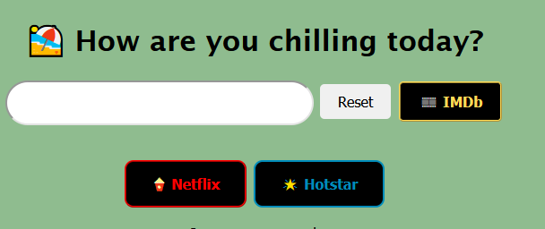

# Chill Where

So you subscribed to Netflix, Amazon Prime and Disney Hotstar. Basically to a LOT of seemingly endless content! 

You come across a movie or TV show you want to watch.
Do you then go into each platform one by one to check which one has it? Sounds tedious.

What if you could run the search from one place?
Use **Chill where?** to type once and search across all your platforms.

How are you planning to chill today?

---
P.S: Stay safe, stay indoor and chill.
